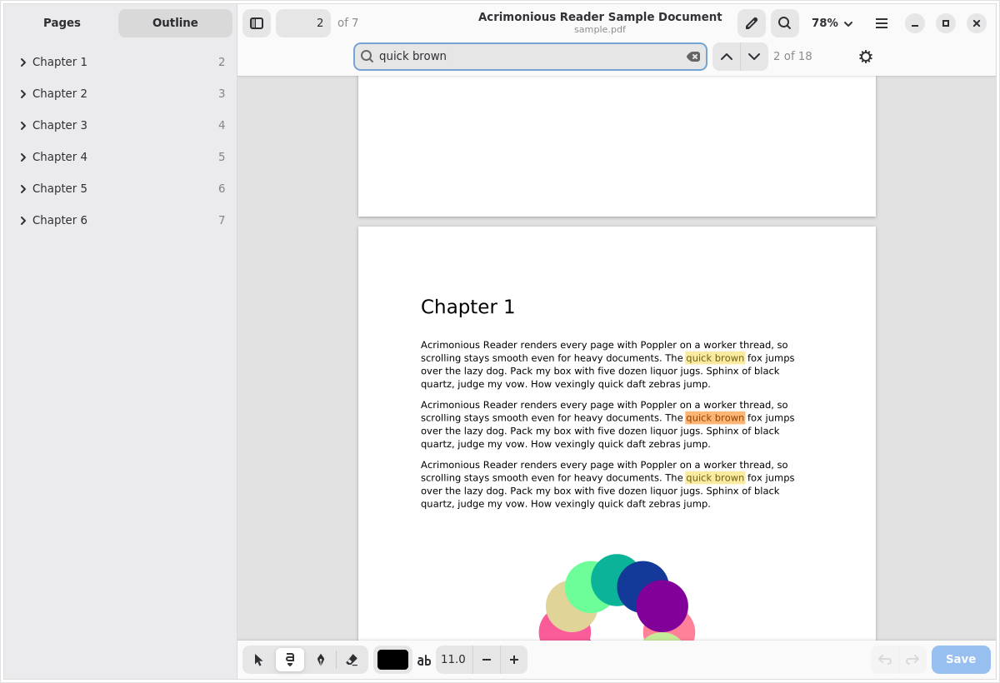

# Acrimonious Reader

A PDF viewer for GNOME that can also fill in and sign forms. Built with GTK 4, libadwaita and
Poppler.



## Install on Debian 13

From the apt repository, so that updates arrive with your normal system updates: follow the
instructions at **https://acrimonious-reader.pages.dev** (one block to paste into a terminal; it
adds the repository, whose signing key is built into the source file, and installs the app).
The key's fingerprint is `7C68 A63C 0048 E9DE E29E  0477 07E0 DF27 E6BB AC17`.

Or download the `.deb` from the [latest release](https://github.com/boergens/acrimonious-reader/releases/latest)
and install it by hand: `sudo apt install ./acrimonious-reader_*_all.deb`.

Acrimonious Reader then appears in the app grid and under "Open With" for PDFs, or run
`acrimonious-reader file.pdf`.

## Features

- **Smooth, responsive view.** Pages render on a worker thread, so the window never waits for
  Poppler. Small pages render in one piece. At high zoom only the visible 1024 px tiles render, so
  zooming to 1600 % stays fast. While new tiles render, the view shows the page from another zoom
  level, scaled.
- **Zoom.** Automatic (fit the width, but no bigger than actual size), Fit Width, Fit Page, presets,
  Ctrl+scroll and pinch zoom anchored at the pointer.
- **Layout.** Continuous scrolling, dual pages, rotation, night mode (inverts brightness but keeps
  colours), fullscreen.
- **Sidebar.** Lazily rendered page thumbnails and the document outline.
- **Search** across the whole document, nearest pages first, with every match highlighted. It
  finds phrases that wrap across lines, and typing "cafe" also finds "café". Options: match case,
  whole words.
- **Links.** Internal links, outline entries and web links work; Back and Forward (Alt+←/→, or
  the mouse's side buttons) return from a jump.
- **Text selection.** Drag to select across pages. Double-click selects a word, triple-click a
  line. Ctrl+C copies, and the selection also goes to the primary clipboard for middle-click paste.
- **Write and draw** (Ctrl+E, or the pencil button): type text boxes onto forms, sign or sketch
  freehand with the pen, and erase. Drag annotations to move them or nudge them with the arrow
  keys; change their colour, text size or pen width; delete and undo. Ctrl+S saves them into the
  PDF as standard annotations (FreeText and Ink) that look the same in other PDF viewers, and they
  stay editable when you open the file here again. You are asked before unsaved changes are lost.
- **Saved signatures.** Draw your signature once on the signing pad (the signature button in the
  writing toolbar), or right-click a drawing on a page and choose "Save as Signature". After that,
  pick it from the signature button and click where it goes. Drag the corner handle to resize it.
  Signatures are stored as strokes in `~/.local/share/acrimonious-reader/signatures.json`, readable
  only by you.
- **Auto-reload.** When the file changes on disk, e.g. after a LaTeX rebuild, the document reloads
  in place. It keeps your position, and the old rendering stays visible until the new one is ready.
- **Remembers** the page, zoom and layout of every document, plus window size, sidebar and night mode.
- Printing, document properties, password-protected PDFs, drag and drop, recent documents,
  and a layout that adapts down to 360 px wide windows.

Press **Ctrl+?** in the app for all keyboard shortcuts.

## Running from source

Needs GTK 4.14+, libadwaita 1.7+ and Poppler 21+ with their Python bindings, and pikepdf: Debian 13,
Ubuntu 25.04, Fedora 42 or newer. On Debian and Ubuntu:

```sh
sudo apt install python3-gi python3-gi-cairo gir1.2-gtk-4.0 gir1.2-adw-1 gir1.2-poppler-0.18 \
    python3-pikepdf fonts-liberation
./bin/acrimonious-reader some.pdf   # run from the source tree
make install                        # or install to ~/.local (PREFIX=... to change)
make uninstall
```

To build the Debian package yourself (`sudo apt install debhelper dh-python` first):

```sh
dpkg-buildpackage -us -uc -b        # writes ../acrimonious-reader_<version>_all.deb
```

## Code

| File | What it does |
| --- | --- |
| `acrimonious_reader/document.py` | Opening PDFs with Poppler, reading outline/links/text, rendering tiles |
| `acrimonious_reader/session.py` | The worker thread (one per document) and the tile, thumbnail and text caches |
| `acrimonious_reader/view.py` | The page view: layout, zoom, scrolling, drawing, selection, mouse and keys |
| `acrimonious_reader/selection.py` | Text hit-testing and highlight geometry on Poppler's text layout |
| `acrimonious_reader/search.py` | Incremental whole-document search |
| `acrimonious_reader/sidebar.py` | Thumbnails and outline |
| `acrimonious_reader/annotations.py` | Text boxes and ink: the model with undo, drawing, hit testing |
| `acrimonious_reader/editing.py` | The writing and drawing tools of the page view (a mixin of `DocumentView`) |
| `acrimonious_reader/pdfwrite.py` | Saving annotations into the PDF with pikepdf, and reading them back |
| `acrimonious_reader/signatures.py` | Saved signatures: the signing pad and the store between sessions |
| `acrimonious_reader/window.py` | The main window: header bar, search bar, actions, loading and saving |
| `application.py`, `shortcuts.py`, `dialogs.py`, `printing.py`, `state.py` | The rest |

While you edit, annotations are drawn by the program itself with cairo; saving gives them appearance
streams drawn by the same code. Poppler can't create ink annotations, which is why saving uses
pikepdf. The program marks its own annotations (`/NM acrimonious-…` plus its data in
`/AcrimoniousItem`), so it can take them back over for editing when the file is opened again.

Poppler isn't thread-safe, so every Poppler call holds `Document.lock`. In practice nearly all of
them run on the session's worker thread, and the main thread only reads finished results.

How the apt repository is built and published: [apt-repo/README.md](apt-repo/README.md).

## Tests

```sh
make test       # needs python3-pytest; qpdf for the password test
```

`tests/sample.py` writes the sample PDF the tests use; run it to get a file to try the viewer on.

## Not (yet) supported

Interactive form fields (AcroForms), highlight and comment annotations, presentation mode, and
documents other than PDF.

## License

GPL-3.0-or-later. See [LICENSE](LICENSE).
